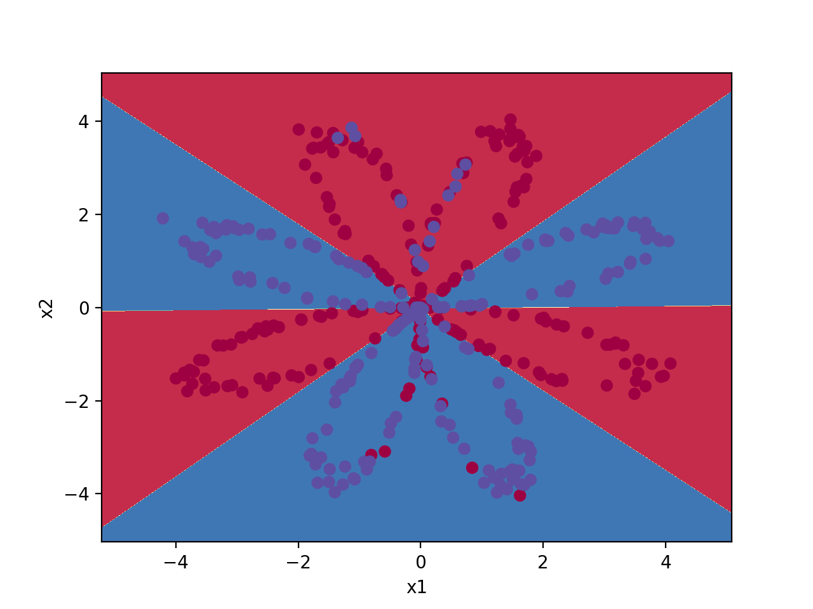

# blai
## Table of contents
* [Introduction](#Introduction)
* [Technologies](#technologies)
* [Versions](#Versions)
* [Setup](#setup)
## Introduction
Blai is a framework to build Neural Networks with python 3.

Use case: Learning points distribution

```
py test_case.py
Cost after iteration 0: 0.693113
Cost after iteration 500: 0.297112
Cost after iteration 1000: 0.282578
Cost after iteration 1500: 0.274960
Cost after iteration 2000: 0.269777
Cost after iteration 2500: 0.265753
Cost after iteration 3000: 0.262318
Cost after iteration 3500: 0.259113
Cost after iteration 4000: 0.241228
Cost after iteration 4500: 0.230191
Cost after iteration 5000: 0.226023
Cost after iteration 5500: 0.223474
Cost after iteration 6000: 0.221621
Cost after iteration 6500: 0.220145
Cost after iteration 7000: 0.218907
Cost after iteration 7500: 0.217835
Cost after iteration 8000: 0.216885
Cost after iteration 8500: 0.216031
Cost after iteration 9000: 0.215260
Cost after iteration 9500: 0.218271
Cost after iteration 9999: 0.217924
Accuracy: 90%
```


## Technologies
Blai needs the libraries listed bellow:
* numpy
* scikit-learn
* matplotlib
* 
## Versions
### blai v1
Made to build simple Neural Networks.
The activation functions developed are: ReLU, sigmoid and tanh
It's possible to build as layers as you want with as neural units as you want.
However, it's not developed any type of Regularization, so that, in really large neural networks could appear vanishing or exploding issues
## Setup
Just download the library. 
Create your model with blai_nn_model function.
Get your predictions with blai_predict function.
Example with a hidden layer with 4 units, where the hidden layer activation function is tanh and the last layer activation function is sigmoid
```
parameters = blai_nn_model(X, Y, units_hidden_layers=[4], act_func="tanh", L_act_func="sigmoid", num_iterations=10000,
                           print_cost=500)

predictions = blai_predict(parameters, X, act_func="tanh", L_act_func="sigmoid")
```


